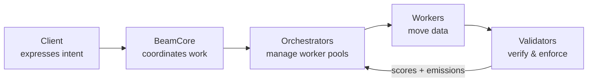

# What is Beam?

**Beam** is an open coordination layer for bandwidth.

It enables data to move across a distributed network of participants where routing decisions are not fixed or centrally controlled, but dynamically determined based on real-time performance. Instead of relying on predefined infrastructure such as cloud providers or CDNs, Beam coordinates a network of independent operators who contribute bandwidth and compete to deliver data efficiently.

At its core, Beam transforms bandwidth into a **measurable, verifiable, and incentivized resource** — turning data transfer into a performance-driven market.

---

## The Problem with Data Movement Today

Data transfer today is not a single system, but a stack of infrastructure layers — cloud networks (AWS, GCP, Azure), CDNs, and the underlying web of transit providers and peering agreements. These systems are powerful but operate as closed environments. Routing decisions are driven by provider policies, BGP, and pre-negotiated relationships — not by real-time application needs or measured end-to-end performance.

What's missing is an open mechanism where paths compete based on latency, throughput, or reliability. Applications cannot express intent, and networks do not dynamically optimize for delivery outcomes.

This limitation is becoming more critical as data movement scales. AI training and distributed workloads are rapidly increasing transfer volumes, and data movement can represent a significant share of total system cost. Cloud providers charge substantial egress fees — typically **$0.08–$0.12 per GB** — reflecting both infrastructure costs and closed ecosystem incentives.

### Structural limitations

| Limitation | Detail |
|---|---|
| **Pricing disconnected from performance** | Bandwidth is priced per GB regardless of delivery quality. No mechanism adapts pricing or routing to real-time conditions. |
| **Routing is not programmable** | Applications cannot dynamically select paths, leverage multiple networks in parallel, or adapt in real time. |
| **Infrastructure is permissioned** | Data delivery is controlled by large providers. Independent operators cannot contribute bandwidth or be rewarded based on performance. |
| **Idle capacity cannot participate** | Significant unused bandwidth exists across data centers, ISPs, and edge networks, but it cannot be programmatically discovered, allocated, or monetized. |

Beam introduces the missing layer — a coordination system where bandwidth becomes **measurable, competitive, and programmable**.

---

## How Beam Works

Beam operates as a real-time coordination layer that orchestrates how data moves across a distributed network of participants. Rather than relying on fixed infrastructure or predefined routes, Beam dynamically selects how data is transferred based on performance, availability, and economic incentives.

---

## Core Roles

Beam is composed of five roles that coordinate to move data across a distributed network. Each role is intentionally separated so that coordination, execution, and verification remain independent — creating a system where performance drives outcomes.

  

    <h4>Clients</h4>
    
Originators of transfer requests — applications, services, enterprises, or AI agents. Clients express <em>intent</em> (move data from A to B under these conditions) and delegate execution to the network.

  

  

    <h4>BeamCore</h4>
    
The coordination layer. Assigns work, tracks transfers, handles retries, and ensures observable, accountable execution. Does not touch the data itself.

  

  

    <h4>Orchestrators</h4>
    
Turn transfer requests into execution strategies. Manage pools of workers, decide chunking and parallelism, and are evaluated on their entire pool's aggregate performance.

  

  

    <h4>Workers</h4>
    
The off-chain execution layer. Move data from source to destination, report completed chunks, and compete to remain in high-performing pools.

  

  

    <h4>Validators</h4>
    
Verify delivery integrity and enforce economic fairness. Confirm that work was real, performance is measurable, and rewards reflect actual contribution.

  

---

## The Competitive Market

Beam creates a fluid, performance-driven marketplace with aligned incentives at every layer:

**Orchestrators** compete to build and maintain the most reliable worker pools. Better performance -> higher PRISM score -> more transfer assignments, while completed qualified production work drives validator weight and $TAO emissions. Orchestrators are evaluated at the *pool level*, so even a small number of weak workers degrades their score. They must also compensate workers fairly - validators enforce this, and failure to pay appropriately reduces future assignments.

**Workers** compete to remain in high-performing pools. They are continuously evaluated on delivery success, throughput, and latency consistency. Workers are not locked into a single orchestrator — they migrate toward orchestrators offering the most reliable work and the best rewards, reinforcing a system where fairness is enforced by market dynamics, not policy alone.

**Validators** bridge off-chain execution with on-chain incentives. They consume BeamCore performance metrics and set weights so orchestrators with stronger delivery receive more emissions over time.

---

## What Beam Enables

### For Clients
- **High-performance transfer** — Data moves in parallel across multiple paths, dynamically optimized for real-time conditions. Particularly valuable for large datasets, AI pipelines, and cross-region systems.
- **Resilient delivery** — Distributed across multiple workers and orchestrators, with automatic recovery from network issues.
- **Programmable routing** — Define intent (source, destination, constraints) and the network determines the best execution strategy.
- **Cost efficiency through competition** — Participants compete to deliver data, aligning cost more closely with actual performance.

### For Orchestrators
- **Performance-based earnings** — Rewards tied to successful delivery and sustained pool quality. Better orchestration → more assignments → higher returns.
- **Pool optimization** — Build and manage worker pools, continuously improving for reliability and throughput.
- **Strategic differentiation** — Specialize by region, workload type, or performance profile.

### For Workers
- **Monetize idle capacity** — Any operator with available bandwidth can participate, turning unused capacity into revenue.
- **Performance-based earnings** — Rewards based on actual delivery quality and throughput.
- **Pool mobility** — Move freely between orchestrators, gravitating toward those with better performance and fair rewards.

---

## Bittensor Subnet 105

Beam operates as **subnet 105** on the Bittensor network. PRISM scores shape production routing, and validators submit task-count-based epoch weights for $TAO emissions. This creates economic incentives for orchestrators to maintain high-quality workers and complete real production work.

:::info
You do not need to interact with Bittensor directly to use Beam as a client. Connectors (S3, R2, GCS, HTTP) abstract all network details.
:::

---

## Key Concepts

- **Transfer** — A request to move data from source to destination, split into chunks and distributed across workers.
- **Task** — A single chunk-level work unit assigned to a specific worker.
- **PRISM** — The scoring algorithm that evaluates orchestrators across throughput, reliability, and performance.
- **Epoch** — A Bittensor time unit (~12 minutes) after which weights are updated and emissions are distributed.

---

## Next Steps

- [Architecture](./architecture) — Understand how the components connect
- [How Transfers Work](./transfers) — Step through the full transfer lifecycle
- [Recovery Timeouts](./transfer-overseer) — Per-stage limits and recovery ranking
- [Orchestrators](./orchestrators) — Learn how to operate or connect to an orchestrator
- [Workers](./workers) — Learn how workers connect and earn
- [Connectors](./connectors/) — Integrate Beam with your existing storage workflow
