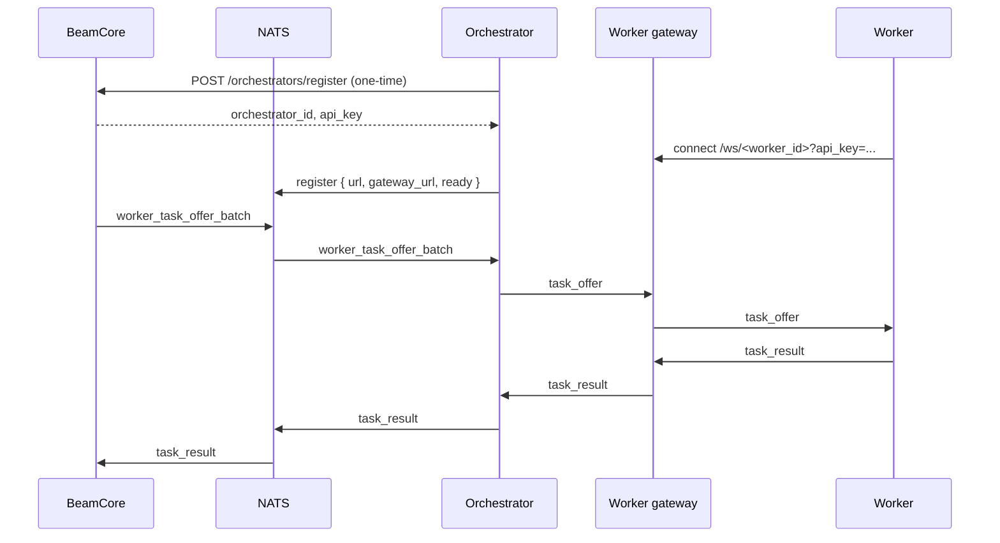

# Orchestrators

Orchestrators operate worker pools, connect to BeamCore over NATS, route executable task offers to workers, and report worker outcomes back to BeamCore. PRISM uses BeamCore-verified throughput and reliability to determine routing share.

## Role

An orchestrator is responsible for:

1. Maintaining an orchestrator-owned worker gateway and worker session pool.
2. Receiving `worker_task_offer_batch` messages from BeamCore over NATS.
3. Selecting a connected local worker for each offer.
4. Relaying worker results to BeamCore immediately.
5. Staying connected and ready so BeamCore can route work.

## Pools

| Pool       | Routing                     |
| ---------- | --------------------------- |
| Qualifying | Calibration transfers       |
| Qualified  | Production client transfers |

## Worker Gateway

Workers connect to the orchestrator-owned worker gateway at `/ws/<worker_id>?api_key=<worker-api-key>`. The worker derives this WebSocket URL from `WORKER_GATEWAY_URL`; the orchestrator advertises the externally reachable gateway origin with `ORCHESTRATOR_WORKER_GATEWAY_URL`, or derives it from its own HTTP address when no override is set. The gateway forwards each task offer to a selected worker and relays worker results back through the orchestrator.



## Batch Offer Message

BeamCore sends executable offers directly:

```json
{
	"type": "worker_task_offer_batch",
	"batch_id": "uuid",
	"offers": [
		{
			"task_id": "uuid",
			"offer_id": "uuid",
			"chunk_size": 8388608,
			"source_url": "https://source-presigned-url",
			"dest_url": "https://dest-presigned-url",
			"urls_expires_at": "2026-06-13T12:00:00.000Z",
			"etag_required": true,
			"source_headers": {},
			"dest_headers": {},
			"minimum_worker_version": "0.2.0"
		}
	]
}
```

Each offer is assigned work for one chunk. The orchestrator keeps worker assignment local and forwards every offer to a connected worker. Local validation or execution failures are reported as failed `task_result` messages.

## Task Results

Workers report task outcomes with canonical `task_result`:

```json
{
	"type": "task_result",
	"task_id": "uuid",
	"offer_id": "uuid",
	"worker_id": "worker-uuid",
	"success": true,
	"bytes_transferred": 8388608,
	"duration_ms": 1234,
	"etag": "\"abc123\"",
	"error": null
}
```

BeamCore derives verified bytes from trusted task metadata and computes bandwidth from offer send time to completion time.

## Registration

Registration is a one-time step that creates your orchestrator record in BeamCore and issues your API key. It must happen **before** the orchestrator connects to NATS — the NATS `register` message only declares your live gateway and readiness, it cannot create the record. An orchestrator that connects without registering first is rejected with `orchestrator_not_routable`.

**Prerequisite:** the hotkey must already be registered on the subnet's metagraph netuid. Otherwise registration fails with `403 hotkey is not registered on this subnet`.

**First-time registration** is unauthenticated and requires a hotkey signature over the message `{hotkey}:{fee_percentage}`:

```
POST $CORE_SERVER_URL/orchestrators/register
Content-Type: application/json

{
  "hotkey": "5F...",
  "signature": "0x...",
  "fee_percentage": 10,
  "name": "my-orchestrator",
  "region": "us-east",
  "url": "https://my-orchestrator.example.com",
  "max_workers": 1000
}
```

Only `hotkey` is required. `fee_percentage` accepts `0`-`100` and defaults to `10`. `name`, `description`, `contact`, `url`, `region`, `max_workers`, `uid`, and `slot_number` are optional; the UID is resolved from the metagraph, so a submitted `uid` is reconciled rather than trusted.

**Example response:**

```json
{
  "orchestrator_id": "...",
  "hotkey": "5F...",
  "api_key": "...",
  "message": "orchestrator registered"
}
```

The `api_key` field is returned **only on first registration** and is not retrievable afterwards — save it immediately.

**Updating metadata** later uses the same endpoint with `x-api-key` instead of a signature:

```
POST $CORE_SERVER_URL/orchestrators/register
x-api-key: <orchestrator-api-key>
Content-Type: application/json

{ "hotkey": "5F...", "region": "eu-west", "max_workers": 2000 }
```

In production, `$CORE_SERVER_URL` is `https://beamcore.b1m.ai`.

### Troubleshooting

`orchestrator_not_routable` when the orchestrator sends its NATS `register` message means BeamCore has no orchestrator record for that hotkey — either registration was never completed, or the hotkey is registered on a different chain or netuid than the environment you are connecting to.

## Setup

Complete [Registration](#registration) first, then set `CORE_SERVER_URL`, `ORCH_GATEWAY_URL`, wallet settings, and `READY=true` when the orchestrator should receive routed work. Set `BEAMCORE_ORCHESTRATOR_API_KEY` to the API key from registration — it is the credential used to connect to NATS. Set production `ORCH_GATEWAY_URL` to `tls://orch-gateway.b1m.ai:4222`. If workers connect through a public or reverse-proxied gateway origin, set `ORCHESTRATOR_WORKER_GATEWAY_URL` to that origin and set each worker's `WORKER_GATEWAY_URL` to the same gateway origin. Keep the NATS control connection and worker gateway sessions healthy so BeamCore can deliver batches.

## Dashboard

The dashboard shows orchestrator readiness, NATS control connection state, PRISM score, transfer batches, task results, and BeamCore-verified throughput. Each recent transfer summarizes winning results as `completed/assigned`, together with worker, failure, superseded-attempt, recovery, and batch-status context.

## History Reset

Orchestrators can wipe their entire transfer history, task records, PRISM scoring evidence, and penalty history in a single call. The result depends on the orchestrator's current pool:

| Current pool | After reset |
|---|---|
| Qualified | Demoted to qualifying pool; must re-accumulate confidence and evidence to graduate again |
| Qualifying | Stays in qualifying; reset to newly-registered state (age clock and scores zeroed) |

**What is deleted:**
- All transfers and their associated tasks, task results, task events, and task attempts
- Fraud penalties attributed to this orchestrator
- All PRISM evidence (hourly buckets, lifetime totals) and all PRISM metric snapshots (qualifying and qualified history)

**What is preserved:**
- Epoch weight history — past per-epoch weight and score records remain visible on the dashboard
- Identity fields (hotkey, UID, name, region)
- Worker registrations
- On-chain weight submissions

**Endpoint:**

```
DELETE /orchestrators/history
Authorization: Bearer <orchestrator-api-key>
Content-Type: application/json

{ "confirm": true }
```

The `confirm: true` body field is required to prevent accidental deletion. The call returns `409` if any transfers are currently active (`pending`, `planning`, or `in_progress`) — wait for active work to complete before wiping.

**Example response:**

```json
{
  "success": true,
  "orchestrator_id": "...",
  "previous_pool": "qualified",
  "new_pool": "qualifying",
  "demoted": true,
  "history_deleted_at": "2026-06-19T12:00:00.000Z",
  "deleted": {
    "transfers": 42,
    "tasks": 187
  }
}
```

This operation is **irreversible**. The `history_deleted_at` field on the orchestrator row is updated each time this endpoint is called.
