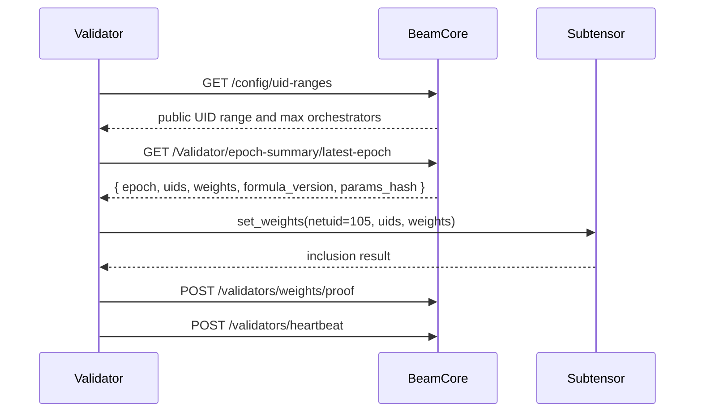

# Validators

Validators are Bittensor-native nodes that read BeamCore's materialized epoch summary, set metagraph weights for subnet 105, and report the on-chain weight proof back to BeamCore.

BeamCore computes PRISM for routing and materializes task-count-based epoch weights; the validator runtime consumes that output and performs the chain submission.

---

## Role

A Beam validator is responsible for:

1. Fetching UID range and network configuration from BeamCore during startup.
2. Fetching the latest weight snapshot from `GET /Validator/epoch-summary/latest-epoch`.
3. Setting the returned UID/weight vector on Bittensor subnet 105.
4. Posting the successful weight-set transcript to `POST /validators/weights/proof`.
5. Sending validator health with `POST /validators/heartbeat`.

The validator may expose local health and state endpoints for operators, but the public runtime contract is the BeamCore HTTP API plus the Bittensor `set_weights` call.

---

## Runtime Flow



The validator waits until its configured weight interval has elapsed before calling `set_weights`. If `BEAM_VALIDATOR_DISABLE_WEIGHT_SET=true`, it keeps the process running but skips the on-chain write.

---

## PRISM And Epoch Summaries

BeamCore computes PRISM from verified throughput, reliability, readiness, and penalty inputs for routing. Validator epoch summaries use completed qualified production task counts for emissions.

Validators consume the already-materialized epoch summary:

```json
{
	"epoch": 17925,
	"uids": [12, 47, 52],
	"weights": [0.8, 0.075, 0.05],
	"formula_version": "tiered_weight_task_done_count_based",
	"params_hash": "..."
}
```

The validator does not call legacy PRISM-weight routes, does not compute PRISM locally for the production path, and does not run a separate metagraph synchronization service.

---

## Mainnet Configuration

Public validator examples target mainnet/prod:

```dotenv
BEAM_VALIDATOR_WALLET_NAME=validator
BEAM_VALIDATOR_WALLET_HOTKEY=default
BEAM_VALIDATOR_CORE_SERVER_URL=https://beamcore.b1m.ai
NETUID=105
SUBTENSOR_NETWORK=finney

# Optional
BEAM_VALIDATOR_PORT=8093
BEAM_VALIDATOR_LOG_LEVEL=INFO
BEAM_VALIDATOR_EXTERNAL_URL=https://validator.example.com
BEAM_VALIDATOR_BLOCKS_BETWEEN_WEIGHTS=100
BEAM_VALIDATOR_DISABLE_WEIGHT_SET=false
```

Validator-specific settings use the `BEAM_VALIDATOR_` prefix. Chain selection uses unprefixed `NETUID` and `SUBTENSOR_NETWORK`.

---

## BeamCore Endpoints Used By The Validator

| Endpoint                                                                                 | Purpose                                                                                     |
| ---------------------------------------------------------------------------------------- | ------------------------------------------------------------------------------------------- |
| `GET /config/uid-ranges`                                                                 | Startup bootstrap for public orchestrator UID range and max orchestrator count              |
| `GET /config/network`                                                                    | Optional network configuration helper                                                       |
| `GET /Validator/epoch-summary/latest-epoch`                                              | Materialized epoch weights used for `set_weights`                                           |
| `POST /validators/weights/proof`                                                         | Records the successful on-chain weight-set transcript                                       |
| `POST /validators/heartbeat`                                                             | Reports validator liveness and advertised URL                                               |
---

## Local Operator Endpoints

The reference validator serves an HTTP API on `BEAM_VALIDATOR_PORT`, default `8093`:

| Endpoint               | Purpose                                                       |
| ---------------------- | ------------------------------------------------------------- |
| `GET /health`          | Basic validator health                                        |
| `GET /health/detailed` | Detailed component checks when health monitoring is available |
| `GET /state`           | Current validator state, UID, epoch, and weight history       |
| `GET /scores`          | Local connection score view                                   |
| `GET /weights`         | Recent on-chain weight-set history                            |

---

## Operational Notes

- Keep the validator wallet hotkey accessible to the process; it signs BeamCore requests and submits `set_weights`.
- Keep `BEAM_VALIDATOR_CORE_SERVER_URL` pointed at the production BeamCore URL.
- Missing weight windows can reduce validator rewards and harm subnet health.
- If the epoch summary is unavailable or has mismatched `uids` and `weights`, the validator skips that weight set rather than inventing local weights.
