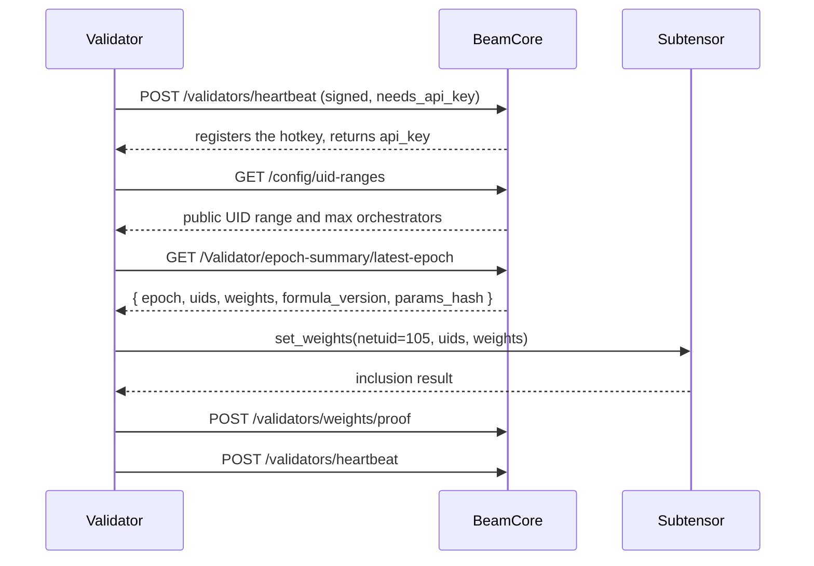

# Validators

Validators are Bittensor-native nodes that read BeamCore's materialized epoch summary, set metagraph weights for subnet 105, and report the on-chain weight proof back to BeamCore.

BeamCore computes PRISM for routing and materializes verified-uploaded-MiB epoch weights; the validator runtime consumes that output and performs the chain submission.

---

## Role

A Beam validator is responsible for:

1. Registering its hotkey and reporting health with `POST /validators/heartbeat`, which also issues the validator API key.
2. Fetching the public orchestrator UID range from BeamCore during startup.
3. Fetching the latest weight snapshot from `GET /Validator/epoch-summary/latest-epoch`.
4. Setting the returned UID/weight vector on Bittensor subnet 105.
5. Posting the successful weight-set transcript to `POST /validators/weights/proof`.

The validator may expose local health and state endpoints for operators, but the public runtime contract is the BeamCore HTTP API plus the Bittensor `set_weights` call.

---

## Runtime Flow


```mermaid
sequenceDiagram
    participant Validator
    participant BeamCore
    participant Subtensor

    Validator->>BeamCore: POST /validators/heartbeat (signed, needs_api_key)
    BeamCore-->>Validator: registers the hotkey, returns api_key
    Validator->>BeamCore: GET /config/uid-ranges
    BeamCore-->>Validator: public UID range and max orchestrators
    Validator->>BeamCore: GET /Validator/epoch-summary/latest-epoch
    BeamCore-->>Validator: { epoch, uids, weights, formula_version, params_hash }
    Validator->>Subtensor: set_weights(netuid=105, uids, weights)
    Subtensor-->>Validator: inclusion result
    Validator->>BeamCore: POST /validators/weights/proof
    Validator->>BeamCore: POST /validators/heartbeat
```

The validator waits until its configured weight interval has elapsed before calling `set_weights`. If `BEAM_VALIDATOR_DISABLE_WEIGHT_SET=true`, it keeps the process running but skips the on-chain write.

---

## PRISM And Epoch Summaries

BeamCore computes PRISM from verified throughput, reliability, readiness, and penalty inputs for routing. Validator epoch summaries use completed qualified production uploaded MiB for emissions.

Validators consume the already-materialized epoch summary:

```json
{
	"epoch": 17925,
	"uids": [12, 47, 52],
	"weights": [0.5, 0.3, 0.2],
	"formula_version": "tiered_weight_verified_uploaded_mib_x_penalty_v3",
	"params_hash": "..."
}
```

The validator does not call legacy PRISM-weight routes, does not compute PRISM locally for the production path, and does not run a separate metagraph synchronization service.

---

## Mainnet Configuration

Public validator examples target mainnet/prod:

```dotenv
BEAM_VALIDATOR_WALLET_NAME=validator
BEAM_VALIDATOR_WALLET_HOTKEY=default
BEAM_VALIDATOR_CORE_SERVER_URL=https://beamcore.b1m.ai
NETUID=105
SUBTENSOR_NETWORK=finney

# Optional
BEAM_VALIDATOR_PORT=8093
BEAM_VALIDATOR_LOG_LEVEL=INFO
BEAM_VALIDATOR_EXTERNAL_URL=https://validator.example.com
BEAM_VALIDATOR_BLOCKS_BETWEEN_WEIGHTS=100
BEAM_VALIDATOR_DISABLE_WEIGHT_SET=false
```

Validator-specific settings use the `BEAM_VALIDATOR_` prefix. Chain selection uses unprefixed `NETUID` and `SUBTENSOR_NETWORK`.

---

## Authentication

A validator authenticates with its wallet hotkey. There is no onboarding form and no credential to request from an operator.

The hotkey signature is the credential that matters: it authenticates the whole weight-setting loop — registration, the epoch summary, the weight proof, and score submission — and nothing in that loop consults an API key. The API key is a secondary credential, issued on request through the heartbeat, that opens the role-scoped PRISM read route. A validator that never touches that route never needs a key.

### Signed Requests

The four routes a validator must call are authenticated by a signature over:

```
validator_auth:<hotkey>:<unix_seconds>:<action>:<nonce>
```

Sign the UTF-8 bytes of that message with the wallet hotkey and send five headers:

| Header                  | Value                                                                                 |
| ----------------------- | ------------------------------------------------------------------------------------- |
| `X-Validator-Hotkey`    | The ss58 hotkey address                                                               |
| `X-Validator-Signature` | Hex signature, with or without a `0x` prefix                                          |
| `X-Validator-Timestamp` | The same unix seconds used in the message                                             |
| `X-Validator-Nonce`     | Fresh random hex, 16 bytes in the reference implementation                            |
| `X-Validator-Action`    | `heartbeat`, `epoch_summary`, `submit_weight_proof`, or `submit_scores`               |

The action is part of the signed message, and it must be the action that route expects, or the request is rejected with `401`. One signature therefore authorizes one route: a `heartbeat` signature cannot fetch the epoch summary, and a generic signature with no action authorizes nothing. The table under [BeamCore Endpoints Used By The Validator](#beamcore-endpoints-used-by-the-validator) gives the action each route requires.

The timestamp must be within 300 seconds of BeamCore's clock, and a nonce is accepted once per hotkey for 600 seconds, so sign each request fresh rather than caching headers.

`build_signed_auth_headers` in `actors/validator/clients/subnet_core_client.py` is the reference implementation.

### First Contact

`POST /validators/heartbeat` is the only signed route open to a hotkey BeamCore has never seen. It verifies key control and nothing else, because it is the route that creates the validator record every other validator action requires.

The other three signed routes additionally require a `validator_permit` on the subnet metagraph, an active validator record, and no active identity ban. Calling one before the first heartbeat returns:

```json
{ "error": "hotkey is not a registered validator; POST /validators/heartbeat first" }
```

A permit alone is deliberately not enough — the chain grants it, so it would let a hotkey that never contacted BeamCore pull the recommended weight vector.

### Getting The API Key

The key is optional, and only `GET /orchestrators/prism-scores/:orch_uid` requires it today. To obtain one, send `needs_api_key: true` in the heartbeat body:

```
POST $CORE_SERVER_URL/validators/heartbeat
X-Validator-Hotkey: 5F...
X-Validator-Signature: <hex>
X-Validator-Timestamp: 1716201600
X-Validator-Nonce: <hex>
X-Validator-Action: heartbeat
Content-Type: application/json

{
  "validator_hotkey": "5F...",
  "validator_uid": 12,
  "status": "online",
  "needs_api_key": true
}
```

The response carries a freshly minted key:

```json
{
  "status": "ok",
  "message": "heartbeat received",
  "api_key": "..."
}
```

The `api_key` field appears **only** when `needs_api_key` is `true`, and the raw key is never retrievable afterwards. Each issuance revokes the previous validator key for that hotkey, so ask for one only when you do not already hold a usable key.

The reference validator keeps the key in memory and requests a new one on every start, which is why a restart invalidates the key the previous process held. A validator that persists its key should send `needs_api_key: false` so the stored key keeps working.

Present the key as an `x-api-key` header. Sending it on a signed route changes nothing — those routes verify the signature and never look at `req.auth` — and sending it alone, without signature headers, is rejected with `401 missing validator signature headers`.

In production, `$CORE_SERVER_URL` is `https://beamcore.b1m.ai`.

---

## BeamCore Endpoints Used By The Validator

| Endpoint                                     | Credential                             | Purpose                                                                        |
| -------------------------------------------- | -------------------------------------- | -------------------------------------------------------------------------------- |
| `POST /validators/heartbeat`                 | Signature, `X-Validator-Action: heartbeat`            | Registers the hotkey on first call, reports liveness, and issues the API key   |
| `GET /Validator/epoch-summary/latest-epoch`  | Signature, `X-Validator-Action: epoch_summary`        | Materialized epoch weights used for `set_weights`                              |
| `POST /validators/weights/proof`             | Signature, `X-Validator-Action: submit_weight_proof`  | Records the successful on-chain weight-set transcript                          |
| `POST /validators/scores/submit`             | Signature, `X-Validator-Action: submit_scores`        | Optional per-orchestrator scores for an epoch                                   |
| `GET /orchestrators/prism-scores/:orch_uid`  | API key                                | Current PRISM breakdown; a validator key may read every UID                    |
| `GET /config/uid-ranges`                     | None              | Startup bootstrap for public orchestrator UID range and max orchestrator count |
---

## Local Operator Endpoints

The reference validator serves an HTTP API on `BEAM_VALIDATOR_PORT`, default `8093`:

| Endpoint               | Purpose                                                       |
| ---------------------- | ------------------------------------------------------------- |
| `GET /health`          | Basic validator health                                        |
| `GET /health/detailed` | Detailed component checks when health monitoring is available |
| `GET /state`           | Current validator state, UID, epoch, and weight history       |
| `GET /scores`          | Local connection score view                                   |
| `GET /weights`         | Recent on-chain weight-set history                            |

---

## Operational Notes

- Keep the validator wallet hotkey accessible to the process; it signs BeamCore requests and submits `set_weights`.
- Keep `BEAM_VALIDATOR_CORE_SERVER_URL` pointed at the production BeamCore URL.
- Missing weight windows can reduce validator rewards and harm subnet health.
- If the epoch summary is unavailable or has mismatched `uids` and `weights`, the validator skips that weight set rather than inventing local weights.
