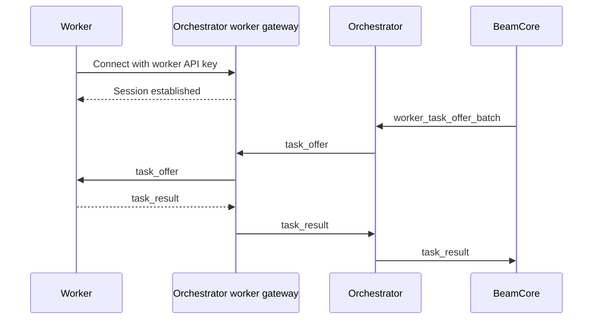

# Workers

Workers are the execution layer of Beam. They connect to an orchestrator-owned worker gateway, receive chunk-level transfer tasks, move data between source and destination backends, and report task results.

## Role

A worker is responsible for:

1. Connecting to its owning orchestrator's worker gateway.
2. Queuing every valid task offer and starting execution as capacity becomes available.
3. Executing chunk transfers from source storage to destination storage.
4. Reporting task results through the orchestrator-owned worker gateway.

Workers are identified by their Bittensor hotkey. A worker is assigned to one orchestrator endpoint at a time.

## Connection

Workers connect to the worker-gateway origin configured in `ORCHESTRATOR_WORKER_GATEWAY_URL`. The worker converts that HTTP origin to WebSocket form and connects to:

```text
ws(s)://<worker-gateway-origin>/ws/<worker_id>?api_key=<worker-api-key>
```



Workers keep their runtime session on the worker gateway and use BeamCore HTTP separately for registration.

## Gateway Events

| Event to worker     | Description                              |
| ------------------- | ---------------------------------------- |
| `task_offer`        | Assigned chunk work                       |
| `task_result_ack`   | BeamCore result delivery status           |
| `session_displaced` | A newer connection replaced this session |

| Event from worker | Description                           |
| ----------------- | ------------------------------------- |
| `task_result`     | Worker reports chunk transfer outcome |

Current public workers report version `0.2.1` and validate each offer's `minimum_worker_version` before execution. Keepalive uses WebSocket ping/pong frames.

## Task Execution

The worker receives:

```json
{
	"type": "task_offer",
	"task_id": "uuid",
	"offer_id": "uuid",
	"chunk_size": 8388608,
	"source_url": "https://presigned-source-url",
	"dest_url": "https://presigned-dest-url",
	"urls_expires_at": "2026-05-22T01:00:00.000Z",
	"etag_required": true,
	"source_headers": {},
	"dest_headers": {},
	"minimum_worker_version": "0.2.0"
}
```

The worker downloads the source range, uploads the destination chunk or multipart part, and sends `task_result`. Failures are also reported through `task_result`. For direct multipart signed URL transfers, the worker returns the provider `ETag`.

## Pool Membership

A worker appears in an orchestrator's assignable pool when:

1. It has registered with BeamCore and received a worker API key.
2. It has an active worker-gateway WebSocket session.
3. Its owning orchestrator selects it for work.
4. The owning orchestrator is connected to BeamCore over NATS and ready.

## Requirements

| Requirement          | Notes                                                                      |
| -------------------- | -------------------------------------------------------------------------- |
| Network connectivity | Stable outbound internet to storage backends and the orchestrator endpoint |
| Bittensor hotkey     | Used for worker identity and authentication                                |
| Worker version        | Current public worker version `0.2.1`                                      |

## Session Displacement

If a worker connects from a new endpoint while an existing session for the same hotkey is active, the older session is displaced. In-progress tasks from the displaced session are reassigned through the normal orchestrator assignment flow.
