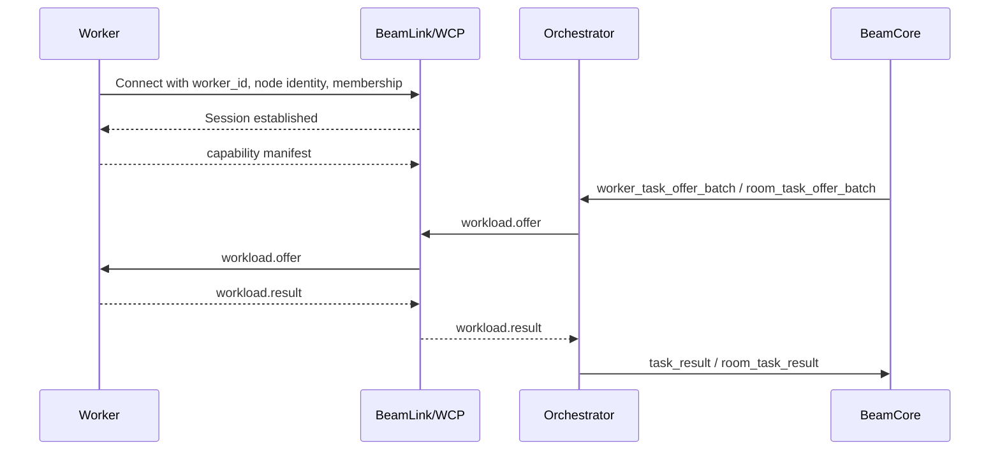

# Workers

Workers are the execution layer of Beam. They connect to an orchestrator over BeamLink/WCP, receive workload offers, move data between source and destination backends or Room transfer leases, and report results.

## Role

A worker is responsible for:

1. Connecting to its owning orchestrator over BeamLink/WCP.
2. Queuing every valid workload offer and starting execution as capacity becomes available.
3. Executing chunk transfers and Room transfer lanes.
4. Advertising capabilities and reporting results through BeamLink/WCP.

Workers are identified by their BeamCore `worker_id` and Bittensor hotkey. A worker is assigned to one orchestrator endpoint at a time.

## Connection

Workers connect to `BEAM_WCP_ADDRESS` using `BEAM_WORKER_ID`, `BEAM_ORCHESTRATOR_ID`, a stable node key, orchestrator membership, `BEAM_WCP_CA`, and `BEAM_WCP_SERVER_NAME`.

```text
./bin/beam-worker serve --node-key data/worker/node.key --capabilities transfer.multipart,room.transfer
```


```mermaid
sequenceDiagram
    participant Worker
    participant WCP as BeamLink/WCP
    participant Orchestrator
    participant BeamCore

    Worker->>WCP: Connect with worker_id, node identity, membership
    WCP-->>Worker: Session established
    Worker-->>WCP: capability manifest
    BeamCore->>Orchestrator: worker_task_offer_batch / room_task_offer_batch
    Orchestrator->>WCP: workload.offer
    WCP->>Worker: workload.offer
    Worker-->>WCP: workload.result
    WCP-->>Orchestrator: workload.result
    Orchestrator->>BeamCore: task_result / room_task_result
```

Workers keep their runtime session on WCP and use BeamCore HTTP separately for registration.

## WCP Events

| Event to worker | Description |
| --- | --- |
| `workload.offer` | Assigned work |
| `workload.commit` | Workload commit confirmation |
| `workload.cancel` | Workload cancellation |
| `evidence.receipt_ack` | Receipt acknowledgement |
| `worker.drain` | Drain request |

| Event from worker | Description |
| --- | --- |
| `heartbeat` | Worker status, resources, and capability manifest |
| `workload.decision` | Worker admission decision |
| `workload.progress` | Workload progress |
| `workload.checkpoint` | Durable checkpoint |
| `workload.result` | Workload result |
| `evidence.receipt` | Workload receipt |

Current public workers advertise `transfer.multipart` and `room.transfer` in canonical capability manifests. Keepalive uses WCP heartbeats.

## Task Execution

For normal transfers, the worker receives a `workload.offer`:

```json
{
	"kind": "transfer.multipart",
	"workload_id": "uuid",
	"attempt_id": "uuid",
	"payload": {
		"transfer_id": "uuid",
		"parts": [
			{
				"index": 0,
				"length": 8388608,
				"source": { "url": "https://presigned-source-url" },
				"destination": { "url": "https://presigned-dest-url", "method": "PUT" }
			}
		]
	}
}
```

The worker downloads the source range, uploads the destination chunk or multipart part, and sends a result. Room transfer workloads use `room.transfer` with room-scoped source and target leases. For direct multipart signed URL transfers, the worker returns the provider `ETag`.

## Pool Membership

A worker appears in an orchestrator's assignable pool when:

1. It has registered with BeamCore and received a worker API key.
2. It has an active BeamLink/WCP session.
3. Its owning orchestrator selects it for work.
4. The owning orchestrator is connected to BeamCore over NATS and ready.

## Requirements

| Requirement          | Notes                                                                      |
| -------------------- | -------------------------------------------------------------------------- |
| Network connectivity | Stable outbound internet to storage backends and the orchestrator endpoint |
| Bittensor hotkey     | Used for worker identity and authentication                                |
| Capability            | Default public worker advertises `transfer.multipart` and `room.transfer`  |

## Session Displacement

If a worker connects from a new endpoint while an existing session for the same worker identity is active, the older session is displaced. In-progress work from the displaced session is reassigned through the normal orchestrator assignment flow.
