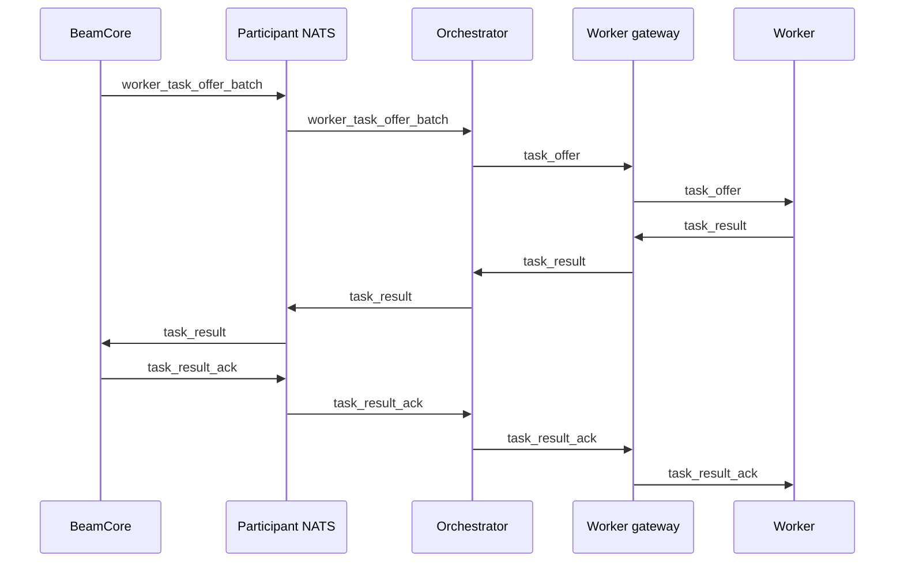

# Participant Control Protocol

BeamCore uses task offer batches as the live transfer lifecycle object. An orchestrator receives executable offers from BeamCore, chooses workers from its local gateway/session pool, and forwards each offer to one worker.

## Control Flow



## Orchestrator Session

Orchestrators connect to BeamCore over NATS using `ORCH_GATEWAY_URL`. The session carries registration, readiness, task offers, and task results.

### `register`

```json
{
	"type": "register",
	"url": "https://orchestrator.example",
	"gateway_url": "https://worker-gateway.example",
	"region": "north-america",
	"max_workers": 100,
	"uid": 12,
	"ready": true,
	"signature": "0x..."
}
```

`gateway_url` is the externally reachable worker gateway origin operated by the orchestrator.

### `worker_task_offer_batch`

BeamCore pushes a batch of executable worker offers:

```json
{
	"type": "worker_task_offer_batch",
	"batch_id": "uuid",
	"offers": [
		{
			"task_id": "uuid",
			"offer_id": "uuid",
			"chunk_size": 8388608,
			"source_url": "https://source-presigned-url",
			"dest_url": "https://dest-presigned-url",
			"urls_expires_at": "2026-06-13T12:00:00.000Z",
			"etag_required": true,
			"source_headers": {},
			"dest_headers": {}
		}
	]
}
```

Each offer is assigned work for one chunk. The orchestrator forwards every delivered `task_offer` to a worker.

### `task_result`

```json
{
	"type": "task_result",
	"task_id": "uuid",
	"offer_id": "uuid",
	"worker_id": "worker-uuid",
	"success": true,
	"chunk_hash": "abc123...",
	"etag": "\"abc123\"",
	"error": null
}
```

Task results carry the success or failure receipt. BeamCore derives verified bytes from trusted task metadata.

### Acknowledgements

BeamCore replies with `task_result_ack`.

```json
{
	"type": "task_result_ack",
	"task_id": "uuid",
	"offer_id": "uuid",
	"received": true,
	"status": "completed",
	"reason": null
}
```

## Worker Session

Workers connect to the worker gateway at `/ws/<worker_id>?api_key=<worker-api-key>` using their BeamCore worker API key. The worker derives this URL from `WORKER_GATEWAY_URL`; use the orchestrator-owned or operator-provided worker gateway origin. The gateway forwards one task offer at a time:

```json
{
	"type": "task_offer",
	"task_id": "uuid",
	"offer_id": "uuid",
	"chunk_size": 8388608,
	"source_url": "https://source-presigned-url",
	"dest_url": "https://dest-presigned-url",
	"urls_expires_at": "2026-06-13T12:00:00.000Z",
	"etag_required": true,
	"source_headers": {},
	"dest_headers": {}
}
```

Workers send `task_result` with `worker_id`.

