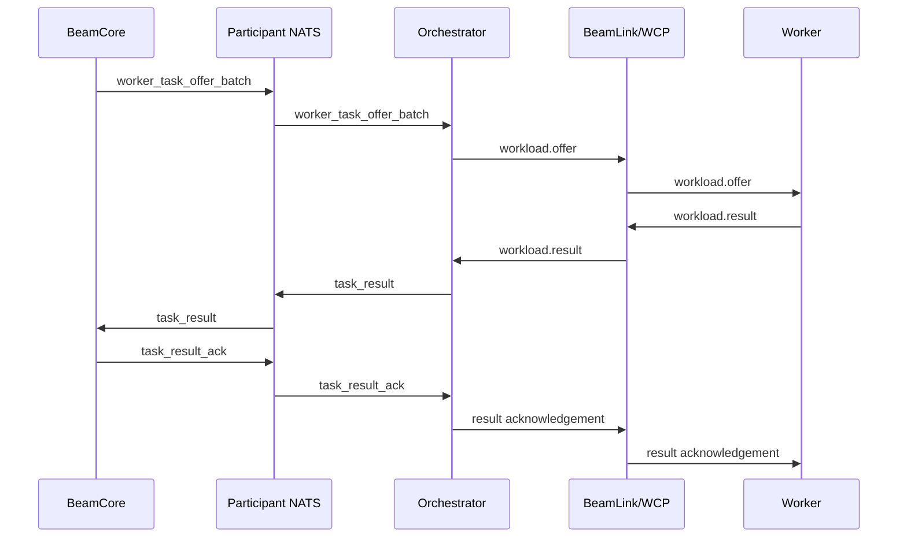

# Participant Control Protocol

BeamCore uses task offer batches as the live transfer lifecycle object. An orchestrator receives executable offers from BeamCore, chooses workers from its local BeamLink/WCP session pool, and forwards each offer to one worker.

## Control Flow


```mermaid
sequenceDiagram
    participant BC as BeamCore
    participant NATS as Participant NATS
    participant O as Orchestrator
    participant WCP as BeamLink/WCP
    participant W as Worker

    BC->>NATS: worker_task_offer_batch
    NATS->>O: worker_task_offer_batch
    O->>WCP: workload.offer
    WCP->>W: workload.offer
    W->>WCP: workload.result
    WCP->>O: workload.result
    O->>NATS: task_result
    NATS->>BC: task_result
    BC->>NATS: task_result_ack
    NATS->>O: task_result_ack
    O->>WCP: result acknowledgement
    WCP->>W: result acknowledgement
```

## Orchestrator Session

Orchestrators connect to BeamCore over NATS using `BEAMCORE_NATS_URL`. The session carries registration, readiness, capability updates, task offers, Room transfer offers, and results.

### `register`

```json
{
	"type": "register",
	"url": "https://orchestrator.example",
	"gateway_url": "https://orchestrator.example",
	"region": "north-america",
	"max_workers": 100,
	"uid": 12,
	"ready": true,
	"signature": "0x..."
}
```

`gateway_url` is the externally reachable orchestrator URL registered with BeamCore.

### `worker_task_offer_batch`

BeamCore pushes a batch of executable worker offers:

```json
{
	"type": "worker_task_offer_batch",
	"batch_id": "uuid",
	"offers": [
		{
			"task_id": "uuid",
			"offer_id": "uuid",
			"chunk_size": 41943040,
			"source_url": "https://source-presigned-url",
			"dest_url": "https://dest-presigned-url",
			"urls_expires_at": "2026-06-13T12:00:00.000Z",
			"etag_required": true,
			"source_headers": {},
			"dest_headers": {}
		}
	]
}
```

Each offer is assigned work for one chunk. The orchestrator forwards every delivered offer to a worker as `workload.offer`.

### `room_task_offer_batch`

BeamCore pushes Room transfer work with schema `room-transfer/v1`. Eligible workers advertise `room.transfer`, and orchestrators return `room_task_result`.

### `task_result`

```json
{
	"type": "task_result",
	"task_id": "uuid",
	"offer_id": "uuid",
	"worker_id": "worker-uuid",
	"success": true,
	"chunk_hash": "abc123...",
	"etag": "\"abc123\"",
	"error": null
}
```

Task results carry the success or failure receipt. BeamCore derives verified bytes from trusted task metadata.

### Acknowledgements

BeamCore replies with `task_result_ack`.

```json
{
	"type": "task_result_ack",
	"task_id": "uuid",
	"offer_id": "uuid",
	"received": true,
	"status": "completed",
	"reason": null
}
```

## Worker Session

Workers connect to their orchestrator over BeamLink/WCP using their BeamCore `worker_id`, orchestrator membership, node identity, TLS CA, and server name. WCP forwards one workload offer at a time:

```json
{
	"type": "workload.offer",
	"payload": {
		"kind": "transfer.multipart",
		"workload_id": "uuid",
		"attempt_id": "uuid",
		"payload": {
			"transfer_id": "uuid",
			"parts": [
				{
					"index": 0,
					"length": 41943040,
					"source": { "url": "https://source-presigned-url" },
					"destination": { "url": "https://dest-presigned-url", "method": "PUT" }
				}
			]
		}
	}
}
```

Workers send `workload.result` with their worker identity. The orchestrator converts completed normal transfer work to `task_result` and completed Room transfer work to `room_task_result`.

